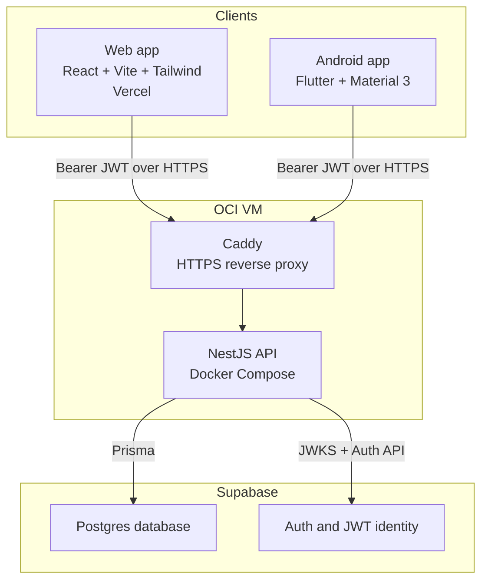
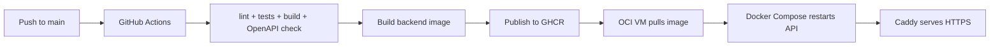

# Architecture

RoomieManager is a multi-client household management system built around one NestJS REST API. The web app and Android app share the same backend, auth provider, data model, and business rules, so chores, balances, members, and contracts stay consistent no matter where a roommate signs in.

## System Map



## Request Flow

1. A user signs in through the web or Android client and receives a Supabase Auth JWT.
2. The client sends JSON requests to `https://api.roomiemanager.site/api/v1` with `Authorization: Bearer <token>`.
3. Caddy terminates HTTPS for `api.roomiemanager.site` and proxies traffic to the Dockerized NestJS service on the OCI VM.
4. The NestJS guard verifies the JWT, resolves the caller, and checks membership/role rules for protected household actions.
5. Services execute business logic and use Prisma to read or write Supabase Postgres.
6. Responses return through the standard envelope with a request ID and timestamp.

The API does not keep server-side session state. Each protected request is authenticated from the bearer token and authorized against the current group membership data.

## Data And Auth Model

Supabase owns identity and persistence:

- **Supabase Auth** handles registration, login, verification email, password recovery, and JWT issuance.
- **NestJS** verifies Supabase-issued JWTs with `jose` and enforces application RBAC.
- **Supabase Postgres** stores the application data.
- **Prisma** defines the schema, migrations, and typed database access.

Core domain objects include:

| Area | Main entities |
| --- | --- |
| Households | `Group`, `GroupMember`, `JoinCode`, `GroupAuditLog` |
| Chores | `Chore`, `ChoreTemplate`, `ChoreActivity` |
| Finance | `Bill`, `BillSplit`, `Payment`, `LedgerEntry` |
| Contracts | `Contract`, `ContractVersion` |

All household data is scoped by group membership. Admin-only actions, such as resetting join codes, changing roles, removing members, and publishing contracts, are checked in the backend service layer.

## Deployment Shape



Production currently runs as:

- Frontend on Vercel at `https://roomiemanager.site`.
- Backend API on an OCI VM at `https://api.roomiemanager.site/api/v1`.
- Caddy as the public HTTPS reverse proxy.
- Docker Compose running the NestJS backend on localhost port `3001`.
- GHCR as the backend image registry.
- Supabase Auth configured with production email verification and password recovery.

The detailed deployment guide is [backend/docs/oci-docker-cicd-deploy.md](backend/docs/oci-docker-cicd-deploy.md).

## API Contract

Every JSON response is wrapped by the backend:

```json
{
  "success": true,
  "data": {},
  "meta": {
    "requestId": "string",
    "timestamp": "ISO-8601"
  }
}
```

Errors use the same envelope shape with an `error` object. This keeps web and mobile error handling consistent and makes request IDs available for debugging.

The OpenAPI source of truth is generated into [backend/openapi/openapi.json](backend/openapi/openapi.json), and TypeScript API types are generated for the frontend in [frontend/generated/backend-api.types.ts](frontend/generated/backend-api.types.ts).

## Quality Gates

The backend `pnpm verify` pipeline covers Prisma generation, migration status, linting, unit tests, e2e tests, TypeScript build, OpenAPI drift checks, and generated frontend type checks. The frontend has a production build check through `pnpm build`, and the Android repo has Flutter unit/widget plus smoke-test commands.
