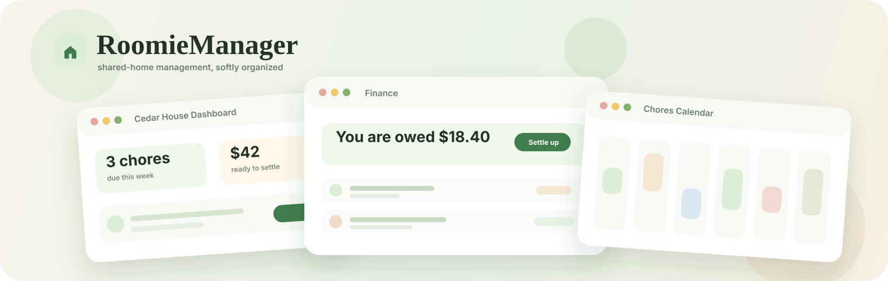

<div align="center">



# 🌿 RoomieManager

**The calm, shared home - organized.**

*Chores, bills, contracts, members, and the quiet rhythms of living together in one warm, green place.*

[](https://roomiemanager.site)
[](https://api.roomiemanager.site/api/v1)
[](https://api.roomiemanager.site/api/docs)

</div>

---

> **What is this?** RoomieManager is a full-stack product for roommates who want to stop negotiating chores in chat threads, stop doing bill math in their heads, and keep house agreements somewhere more dependable than memory. One group, one source of truth, one cozy interface.

<div align="center">
  
  <br />
  <sub><em>The front door. Sign in, join a group, settle in.</em></sub>
</div>

— · — · — · —

## ✨ What's Inside

<table>
  <tr>
    <td width="33%" valign="top">
      <h3>🏠 Groups</h3>
      Join codes, member roles, active memberships, and a household-shaped permission model.
    </td>
    <td width="33%" valign="top">
      <h3>📋 Chores</h3>
      One-off tasks, recurring templates, assignments, completion rules, and calendar-ready views.
    </td>
    <td width="33%" valign="top">
      <h3>💸 Finance</h3>
      Bills, splits, payments, running balances, and settlement suggestions without the spreadsheet ritual.
    </td>
  </tr>
  <tr>
    <td valign="top">
      <h3>📜 Contracts</h3>
      Editable drafts, published versions, and history for the agreements that keep a house clear.
    </td>
    <td valign="top">
      <h3>🔐 Auth</h3>
      Supabase-backed registration, login, email verification, password recovery, and JWT verification.
    </td>
    <td valign="top">
      <h3>📊 Dashboard</h3>
      The morning glance: what is due, what is owed, and what needs attention next.
    </td>
  </tr>
</table>

— · — · — · —

## 🧱 Stack At A Glance

**Web** &nbsp;


**API** &nbsp;


**Platform** &nbsp;


— · — · — · —

## 🌐 One Product, Three Surfaces

```text
roomiemanager.site
  React + TypeScript + Vite + Tailwind
  deployed on Vercel
        |
        | HTTPS + Bearer JWT
        v
api.roomiemanager.site/api/v1
  NestJS + Prisma in Docker on OCI
  Caddy handles HTTPS
        |
        v
Supabase
  Postgres + Auth

RoomieManager Android Port
  Flutter + Material 3
  same API, mobile-first UX
```

The backend owns the business rules. Web and Android share the same auth model, group data, chores, bills, balances, contracts, and response envelope.

— · — · — · —

## 🚀 Quickstart

> **Prereqs:** Node 20+, **pnpm 9**, and Supabase database/auth credentials.

```bash
git clone https://github.com/GSU-BitByBit/RoomieManager.git
cd RoomieManager
```

<table>
  <tr>
    <td width="50%" valign="top">

### 🟢 Backend

```bash
cd backend
pnpm install
cp .env.example .env
pnpm prisma:generate
pnpm prisma:migrate:deploy
pnpm dev
```

API: `http://localhost:3000/api/v1`

  </td>
  <td width="50%" valign="top">

### 🟢 Frontend

```bash
cd frontend
pnpm install
cp .env.example .env
pnpm dev
```

Web: `http://localhost:5173`

  </td>
  </tr>
</table>

For Android:

```bash
cd ../RoomieManager\ Android\ Port
flutter pub get
flutter run --dart-define=ROOMIE_API_BASE_URL=https://api.roomiemanager.site/api/v1
```

— · — · — · —

## 🗺️ Repository Map

```text
RoomieManager/
├── frontend/        React 18 + Vite 6 + Tailwind - the cozy interface
├── backend/         NestJS 10 + Prisma 5 - the rules of the house
├── docs/            Visual assets, docs index, and project notes
├── ARCHITECTURE.md  How a request travels through the system
├── AGENTS.md        Contributor and coding-agent reference
└── README.md        You are here
```

— · — · — · —

## 📚 Read More

| | |
| --- | --- |
| 🏛 **Architecture** | [ARCHITECTURE.md](ARCHITECTURE.md) - the story of a request |
| 🧩 **Frontend** | [frontend/README.md](frontend/README.md) - the interface |
| ⚙️ **Backend** | [backend/README.md](backend/README.md) - the engine |
| 📖 **Docs index** | [docs/README.md](docs/README.md) - assets and references |
| 📱 **Android port** | [RoomieManager-Android-Port](https://github.com/Harry830/RoomieManager-Android-Port) - the same home, in your pocket |

— · — · — · —

## 🧪 Verification

```bash
cd backend
pnpm verify
```

```bash
cd frontend
pnpm build
```

```bash
curl https://api.roomiemanager.site/api/v1/health/live
curl https://api.roomiemanager.site/api/v1/health/ready
```

— · — · — · —

<div align="center">
  <sub>Built with care for calmer shared homes.</sub>
</div>
