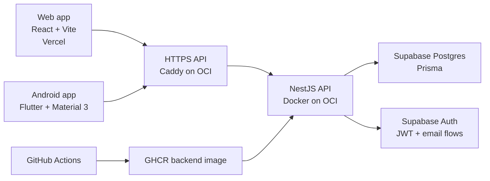

# RoomieManager

A calm shared-home management app for roommates who want the house to feel organized without turning daily life into a spreadsheet. RoomieManager brings chores, shared bills, payments, balances, contracts, dashboards, and household roles into one warm, practical workspace.


**Live web app:** [roomiemanager.site](https://roomiemanager.site)<br>
**API base:** [api.roomiemanager.site/api/v1](https://api.roomiemanager.site/api/v1)<br>
**Swagger docs:** [api.roomiemanager.site/api/docs](https://api.roomiemanager.site/api/docs)

## For Reviewers

RoomieManager is built to show both product thinking and production-minded engineering. The project has a live web app, a shared backend consumed by web and Android clients, Supabase-backed auth and data, a Dockerized OCI backend deployment, Vercel frontend deployment, CI/CD, OpenAPI contract generation, and focused test coverage around the core roommate workflows.

If you are reviewing quickly, start with the live web app, skim the architecture map below, then visit the backend and frontend READMEs for implementation details.

## What It Covers

- **Households and members:** create groups, join with codes, manage membership, and enforce admin/member roles.
- **Chores:** create one-off chores, manage recurring templates, assign work, complete tasks, and view calendar-ready data.
- **Shared finances:** add bills, split costs, record payments, calculate balances, and suggest settlements.
- **Contracts:** maintain a group agreement draft, publish versions, and keep version history.
- **Dashboard:** give each household a quick view of what needs attention.
- **Auth:** support email/password registration, login, email verification, password recovery, and current-user identity.

## How It Fits Together



Two clients, one source of truth: the NestJS API owns the business rules, Prisma owns database access, and Supabase owns identity and persistence.

For the expanded system walkthrough, see [ARCHITECTURE.md](ARCHITECTURE.md).

## Tech Stack

| Layer | Technology |
| --- | --- |
| Web frontend | React 18, Vite 6, TypeScript, Tailwind CSS, React Router |
| Backend API | NestJS 10, TypeScript, Prisma 5, Zod, class-validator, Pino |
| Data and auth | Supabase Postgres, Supabase Auth, JWT verification with `jose` |
| Mobile | Flutter, Material 3, Provider, GoRouter, Secure Storage |
| Deployment | Vercel frontend, OCI VM backend, Docker Compose, Caddy, GHCR |
| CI/CD | GitHub Actions, pnpm 9, Node 20 |

## Repository Guide

| Path | Purpose |
| --- | --- |
| [backend/](backend/) | NestJS REST API, Prisma schema, migrations, OpenAPI contract, Docker runtime assets, and backend tests. |
| [frontend/](frontend/) | Vite React web app, shared API client, auth pages, dashboard, and household workflows. |
| [docs/](docs/) | Project-level documentation and README assets. |
| [backend/docs/](backend/docs/) | Production deployment notes for OCI, Docker, Caddy, GHCR, GitHub Actions, and Supabase email flows. |
| [frontend/frontend_reference.md](frontend/frontend_reference.md) | Deeper backend API integration reference for frontend and mobile work. |
| [Use case diagram and requirements/](Use%20case%20diagram%20and%20requirements/) | Original requirements, use-case diagram source, early wireframes, and testing notes. |
| [AGENTS.md](AGENTS.md) | Contributor and coding-agent reference for architecture, commands, conventions, and module status. |
| `../RoomieManager Android Port/` | Flutter Android companion app that talks to the same backend API. |

## Run It Yourself

This repository is not a workspace monorepo. Run backend and frontend commands from their own directories.

### Backend

```bash
cd backend
cp .env.example .env
pnpm install
pnpm prisma:generate
pnpm prisma:migrate:deploy
pnpm dev
```

The local API runs at `http://localhost:3000/api/v1`. Fill `.env` with Supabase database and auth values before running migrations or auth-backed flows.

### Frontend

```bash
cd frontend
cp .env.example .env
pnpm install
pnpm dev
```

The local web app runs at `http://localhost:5173`. Leave `VITE_API_BASE_URL` blank to use the Vite `/api/v1` proxy against a local backend, or set it to `https://api.roomiemanager.site/api/v1` to call production.

### Android Port

```bash
cd ../RoomieManager\ Android\ Port
flutter pub get
flutter run --dart-define=ROOMIE_API_BASE_URL=https://api.roomiemanager.site/api/v1
```

For Android emulator local-backend testing, the app defaults to `http://10.0.2.2:3000/api/v1`.

## Verification

Backend confidence gate:

```bash
cd backend
pnpm verify
```

Frontend build check:

```bash
cd frontend
pnpm build
```

Production smoke checks:

```bash
curl https://api.roomiemanager.site/api/v1/health/live
curl https://api.roomiemanager.site/api/v1/health/ready
```

## Production Shape

| Surface | Deployment |
| --- | --- |
| Web app | Vercel at [roomiemanager.site](https://roomiemanager.site) |
| Backend API | OCI VM at [api.roomiemanager.site/api/v1](https://api.roomiemanager.site/api/v1) |
| HTTPS proxy | Caddy terminating TLS and proxying to Docker |
| Backend runtime | Docker Compose running the NestJS service on localhost port `3001` |
| Image registry | GHCR backend image built by GitHub Actions |
| Data and auth | Supabase Postgres and Supabase Auth |

The operational walkthrough lives in [backend/docs/oci-docker-cicd-deploy.md](backend/docs/oci-docker-cicd-deploy.md).

## Demo And Design Assets

The live web app is the best current preview of the product experience. Early wireframes and requirements are preserved in [Use case diagram and requirements/](Use%20case%20diagram%20and%20requirements/), and project README assets live in [docs/assets/](docs/assets/).

## Contributing

Use [AGENTS.md](AGENTS.md) as the main contributor reference. It captures the architecture, commands, coding conventions, RBAC rules, environment expectations, and current module status.
