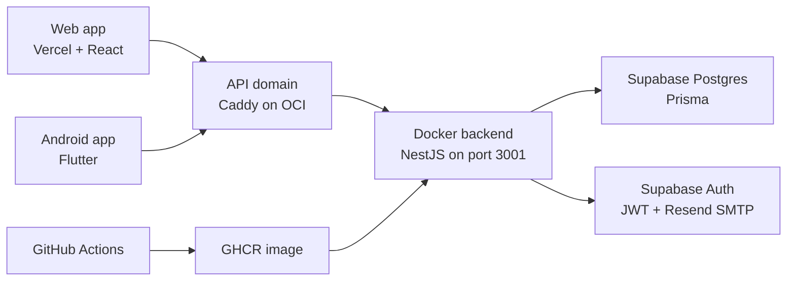

# RoomieManager

RoomieManager is a calm shared-home management app for roommates who want the house to feel organized without turning daily life into a spreadsheet. It brings household groups, chores, shared bills, payments, balances, contracts, and member roles into one warm, practical workspace.

[Live web app](https://roomiemanager.site) | [Production API](https://api.roomiemanager.site/api/v1/health/live) | [Swagger docs](https://api.roomiemanager.site/api/docs)

## At A Glance

- Web app: Vite, React, TypeScript, Tailwind, deployed on Vercel.
- Backend API: NestJS, Prisma, Supabase Postgres/Auth, deployed on OCI in Docker behind Caddy.
- Android app: Flutter companion app in the sibling `RoomieManager Android Port` project.
- Auth: Supabase Auth with Resend-backed SMTP email verification and password recovery.
- CI/CD: GitHub Actions verifies the backend, builds a GHCR image, and deploys to OCI on `main`.
- Quality: backend verification covers linting, unit tests, e2e tests, build checks, OpenAPI drift checks, and generated frontend API types.

## Why It Matters

Shared homes work best when expectations are visible and fair. RoomieManager gives a household one place to answer everyday questions like "Who has dishes tonight?", "Who paid for groceries?", "What do I owe?", and "What did we agree to?" without a group chat archaeology dig.

The project is intentionally practical: it is live, deployed, tested, and designed around the real workflows roommates hit every week.

## Product Highlights

- Household groups with join codes, membership lifecycle, admin/member roles, and safe leave/remove flows.
- Chore management with one-off chores, recurring templates, assignments, completion rules, and calendar views.
- Shared finance workflows for bills, splits, payments, group balances, and settlement suggestions.
- Group contracts with editable drafts, publishing, and version history.
- Email verification, password recovery, and reset flows through Supabase Auth.
- Consistent API response envelopes, request IDs, health checks, and generated OpenAPI types.

## System Map



## Repository Guide

| Path | Purpose |
| --- | --- |
| [`backend/`](backend/) | NestJS REST API, Prisma schema, migrations, OpenAPI contract, Docker runtime assets, backend tests. |
| [`frontend/`](frontend/) | Vite React web app, shared API client, auth pages, dashboard and household workflows. |
| [`backend/docs/oci-docker-cicd-deploy.md`](backend/docs/oci-docker-cicd-deploy.md) | Production deployment notes for OCI, Docker, Caddy, GHCR, GitHub Actions, and Supabase SMTP. |
| [`backend/docs/email-templates/`](backend/docs/email-templates/) | RoomieManager-branded Supabase email template source. |
| [`frontend/frontend_reference.md`](frontend/frontend_reference.md) | Detailed backend API integration reference for frontend work. |
| [`Use case diagram and requirements/`](Use%20case%20diagram%20and%20requirements/) | Original requirements, use-case diagram source, and early wireframes. |
| [`AGENTS.md`](AGENTS.md) | Contributor and coding-agent reference for architecture, commands, conventions, and module status. |
| `../RoomieManager Android Port/` | Flutter Android companion app that talks to the same backend API. |

## Demo And Design Assets

The live web app is the best current preview of the product experience. Early wireframes and requirements are preserved in [`Use case diagram and requirements/`](Use%20case%20diagram%20and%20requirements/), and the production Supabase email template source lives in [`backend/docs/email-templates/`](backend/docs/email-templates/).

## Tech Stack

| Layer | Stack |
| --- | --- |
| Web | React 18, Vite 6, TypeScript, Tailwind CSS, React Router |
| Mobile | Flutter, Provider, GoRouter, Secure Storage |
| API | NestJS 10, TypeScript, Prisma, Zod, class-validator, Pino |
| Data/Auth | Supabase Postgres, Supabase Auth, JWT verification with `jose` |
| Email | Resend SMTP through Supabase Auth templates |
| Deployment | Vercel frontend, OCI VM backend, Docker Compose, Caddy, GHCR |
| CI/CD | GitHub Actions, pnpm 9, Node 20 |

## Run Locally

This repository is not a monorepo workspace. Run backend and frontend commands from their own directories.

### Backend

```bash
cd backend
cp .env.example .env
pnpm install
pnpm prisma:generate
pnpm prisma:migrate:deploy
pnpm dev
```

The local API runs at `http://localhost:3000/api/v1` by default. Fill `.env` with Supabase database/auth values before running migrations or auth-backed flows.

### Frontend

```bash
cd frontend
cp .env.example .env
pnpm install
pnpm dev
```

The local web app runs at `http://localhost:5173`. Remove or leave `VITE_API_BASE_URL` blank to use the Vite `/api/v1` proxy against a local backend. Keep `VITE_API_BASE_URL=https://api.roomiemanager.site/api/v1` if you want the local frontend to call production.

### Android Port

```bash
cd ../RoomieManager\ Android\ Port
flutter pub get
flutter run --dart-define=ROOMIE_API_BASE_URL=https://api.roomiemanager.site/api/v1
```

For Android emulator local-backend testing, the app defaults to `http://10.0.2.2:3000/api/v1`.

## Verification

Backend quality gate:

```bash
cd backend
pnpm verify
```

Frontend build check:

```bash
cd frontend
pnpm build
```

Production smoke checks:

```bash
curl https://api.roomiemanager.site/api/v1/health/live
curl https://api.roomiemanager.site/api/v1/health/ready
```

## Production Deployment

RoomieManager is currently deployed with:

- Frontend on Vercel at `https://roomiemanager.site`.
- Backend on an OCI VM at `https://api.roomiemanager.site/api/v1`.
- Caddy as the public HTTPS reverse proxy.
- Docker Compose running the NestJS backend on localhost port `3001`.
- GHCR as the backend image registry.
- GitHub Actions deploying backend changes automatically after `main` passes verification.
- Supabase Auth using Resend SMTP for verification and password recovery emails.

See [`backend/docs/oci-docker-cicd-deploy.md`](backend/docs/oci-docker-cicd-deploy.md) for the operational notes.

## For Evaluators

RoomieManager is built to show both product thinking and production-minded engineering. The app has a real deployed web experience, a shared backend consumed by web and mobile clients, a tested API contract, cloud database/auth integration, and a Dockerized OCI deployment with CI/CD.

If you are reviewing quickly, start with the live web app, then skim the system map above, the backend README, and the deployment doc.
