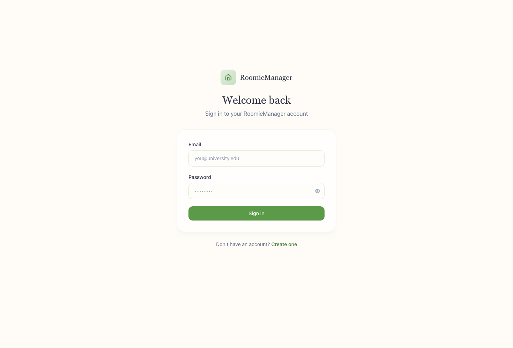

# RoomieManager Web Frontend

The web app is the warm, everyday face of RoomieManager: a calm dashboard for joining a household, managing chores, tracking shared bills, reviewing balances, and keeping house agreements in one place.

**Live web app:** [roomiemanager.site](https://roomiemanager.site)<br>
**Production API:** [api.roomiemanager.site/api/v1](https://api.roomiemanager.site/api/v1)



## App Surfaces

- Login, registration, email callback, forgot password, and reset password flows.
- Groups page for creating households, joining with codes, and choosing the active home.
- Dashboard overview with household status and upcoming work.
- Chores page with assignments, completion, calendar views, and recurring templates.
- Members page for role management and household membership actions.
- Finance page for bills, payments, balances, and settlement context.
- Contracts page for shared agreements and version history.

## Stack

| Layer | Technology |
| --- | --- |
| App shell | Vite 6 |
| UI | React 18, TypeScript, Tailwind CSS |
| Routing | React Router |
| Icons | lucide-react |
| API | RoomieManager REST API |
| Deployment | Vercel |

## Local Setup

```bash
cp .env.example .env
pnpm install
pnpm dev
```

Local app: `http://localhost:5173`<br>
Production app: `https://roomiemanager.site`

## Environment

The frontend can call the API in two ways:

- `VITE_API_BASE_URL=https://api.roomiemanager.site/api/v1` calls production directly.
- Leaving `VITE_API_BASE_URL` empty uses `/api/v1`, which works with the Vite dev proxy and Vercel rewrites.

For local backend work, [.env.example](.env.example) includes:

```bash
VITE_API_PROXY_TARGET=http://localhost:3000
VITE_API_BASE_URL=https://api.roomiemanager.site/api/v1
```

If you want local frontend requests to hit your local backend, remove or blank out `VITE_API_BASE_URL` after copying the example file.

## Commands

```bash
pnpm dev
pnpm build
pnpm preview
```

## API Contract

The frontend API client lives in [src/lib/api.ts](src/lib/api.ts). It expects the backend response envelope, attaches bearer tokens from local storage when needed, and throws typed `ApiError` instances for wrapped backend errors.

Generated backend types live in [generated/backend-api.types.ts](generated/backend-api.types.ts). Regenerate them from the backend with:

```bash
cd ../backend
pnpm openapi:types:generate
```

For deeper endpoint behavior and response-shape notes, see [frontend_reference.md](frontend_reference.md).

## Deployment

The web app is deployed on Vercel. [vercel.json](vercel.json) keeps `www.roomiemanager.site` redirected to the apex domain and rewrites `/api/*` requests to the production API domain.

The visual direction is intentionally soft and homey: cream surfaces, sage accents, rounded cards, and straightforward copy that feels like a shared home rather than an enterprise dashboard.
